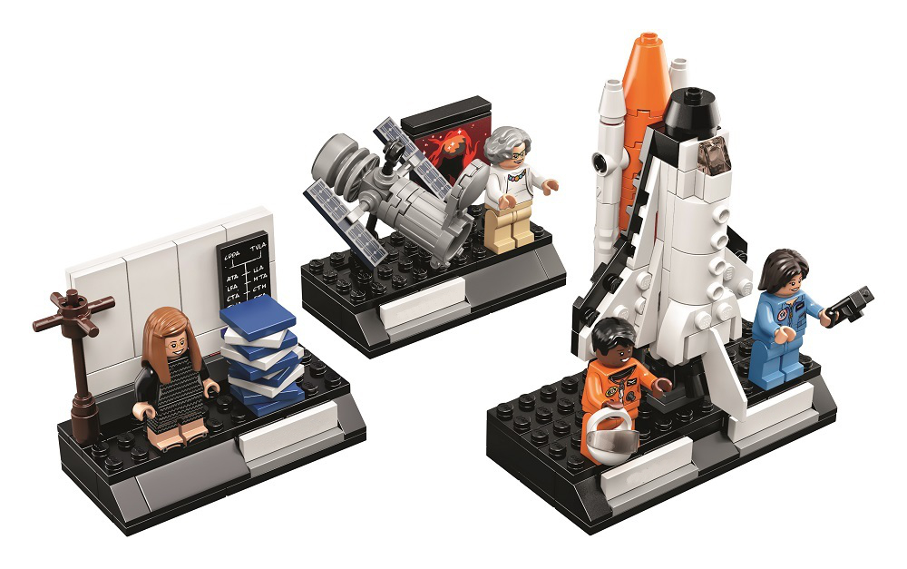

theme: Zurich, 4

# Round 2

---

# Name Simon Pegg's co-star from the movies Shawn of the Dead, Hot Fuzz and The World's End?

---

# Name the strongest hurricane to hit Ireland in 50 years

---

# What Irish nobel laureate fought in the French resistance during WWII?

---

## Within the Matrix, what was Neo's name?

---

## What does GPS stand for?

---

# What year was Netscape Navigator released?

---

# The LEGO set titled “Women in Space” is dedicated to famous women who have contributed to space travel. Can you name them? (1pt each)

---

# In Star Wars Han Solo infamously did the Kessel Run in 12 parsecs. How long is a parsec?
1. 2.45 light years
2. 3.26 light years
3. 4.78 light years

---

# In what year did Edmund Hilary and Tenzing Norgay reach the summit of Everest for the first time?

---

# What project won The Nobel Prize in Physics 2017? (Bonus 2pts for the full name)

---

# End of Round!

## Pass Answer Sheets to the Next Team

